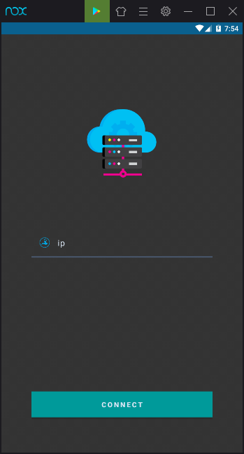
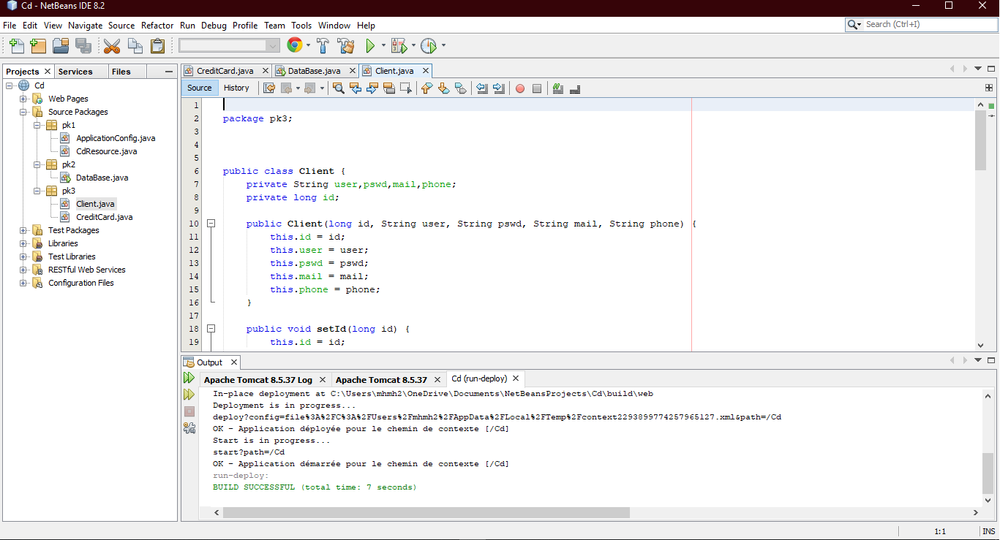

# CreditCard
Credit Card Management (Android Mobile Application)

- Consuming a JEE RESTful web service
- Management of the database by JEE and Volley API.
- Using Design Patterns.


## CreditCardClient
Android Mobile Application is [here](https://github.com/m-elkhou/CreditCard/tree/master/app)



## CreditCardServer
JEE Web Application (Developed in Netbeans 8) is [here](https://github.com/m-elkhou/CreditCard/tree/master/Cd)
```
- Project can be direct started in Netbeans 8 (Apache Tomcat 8.5.37)
```


<br />

***
### Links
- [E-mail : ](mailto:m.elkhou@hotmail.com) m.elkhou@hotmail.com
- [Linkedin](https://www.linkedin.com/in/m-elkhou/)
- [GitHub](https://github.com/m-elkhou)<br/>
=>https://github.com/m-elkhou/CreditCard.git
